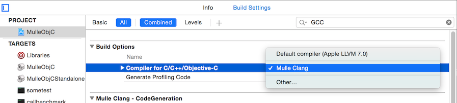

# mulle-objc-developer

[](https://travis-ci.org/mulle-nat/mulle-objc-developer)


This project installs all required items together into a single formula and
supplies you with a script `mulle-objc-init` to setup your own *mulle-objc*
projects.

This is also the goto project for
[issues on GitHub](https://github.com/mulle-objc/mulle-objc-developer/issues),
that don't match any of the other projects or where it's unclear where they
belong.

## Installation

### Install on OS X

You install **mulle-objc-developer** with [brew](//brew.sh):

```
brew install mulle-kybernetik/software/mulle-objc-developer
```

This will install the [mulle-clang](//github.com/codeon-gmbh/mulle-clang)
compiler and some necessary scripts .

> See [mulle-objc Community](//mulle-objc.github.io) for more information.


### Install on Unbuntu Linux and WSL/bash

This methods works for **trusty**, **xenial** and **zesty**:

```
curl -L -O 'https://raw.githubusercontent.com/mulle-nat/mulle-objc-developer/release/install-ubuntu.sh'
chmod 755 install-ubuntu.sh
./install-ubuntu.sh
```

## Create a mulle-objc project

### mulle-objc-init

Use `mulle-objc-init` to create a hello world project. This will download and compile quite a
few dependencies.


```
mulle-objc-init --cache -d /tmp/demo executable
cd /tmp/demo
mulle-build --bootstrap
```

Now run your Objective-C executable:

```
./build/demo
```

Your code and your project is automatically portable across all supported platforms!


### mulle-objc-init usage


```
usage:
   mulle-objc-init [options] [command]

   Options:
      -d <dir>   : use "dir" instead of working directory
      --dev      : add conventional configurations for MulleObjC developers
      -f         : overwrite existing files
      -n         : don't actually do anything

   Command:
      check      : check current project
      executable : create a mulle-objc executable project
      library    : create a mulle-objc library project
      version    : print mulle-objc-developer version
```

## Xcode integration

### Xcode 8
 For *Xcode 7* we can use [`mulle-clang-add-to-xcode.sh`](mulle-clang-add-to-xcode.sh)  to integrate **mulle-clang** with project anyhow this doesn't work for *Xcode 8* since [Xcode 8 uses library validation.](https://github.com/alcatraz/Alcatraz/issues/475)

**Xcode 8 integration for mulle-clang with CMake**

 ```bash
cd <pathToProjectDir>/MulleObjC
```

```bash
mkdir build-xcode.d ; cd build-xcode.d ; cmake -G "Xcode" .. ; open *.xcodeproj
```

### Xcode 7

You can get *Xcode 7* integration for **mulle-clang**. mulle-clang will appear as
an available compiler in Xcode in the "Build Settings":




<br>
Run [`mulle-clang-add-to-xcode.sh`](mulle-clang-add-to-xcode.sh) to integrate
the **mulle-clang** compiler into Xcode. This will install a plugin in
`~/Volumes/Users/nat/Library/Application\ Support/Developer/Shared/Xcode/Plug-ins`:

```
mulle-clang-add-to-xcode.sh
```

The `.xcconfig` string for the compiler is:

```
GCC_VERSION = de.codeon.compilers.mulle-clang
```


## Developing mulle-objc itself

If you want to hack on `mulle-objc` it is easiest to use the supplied
script [`mulle-objc-clone`](mulle-objc-clone) to setup things on
your machine.


This needs [mulle-build](//mulle-nat/mulle-build) as a pre-requisite.

```
brew install mulle-kybernetik/software/mulle-build
```

Now run `mulle-objc-clone.sh` in a directory, where you want the repositories +
to reside in. Then you can just compile and test any project conveniently
with **mulle-build**:

```
mulle-objc-clone
#
cd MulleObjC
mulle-build -y --bootstrap
mulle-test
```

You can use the supplied **Xcode** project files to edit and build the projects, but in order for them
to work you must run `mulle-build -y` (or `mulle-bootstrap -y`) once.
