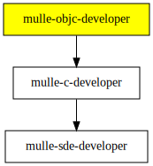

# mulle-objc-developer

#### 🎩 mulle-objc developer kit for mulle-sde

This is a collection of [mulle-sde](//github.com/mulle-sde)
*extensions* to support development of [MulleObjC](//github.com/mulle-objc)
code. As a package **mulle-objc-developer** is also a convenient way to
install mulle-sde and [mulle-clang](//github.com/Codeon-GmbH/mulle-clang).

### You are here

## Install

Install [foundation-developer](//github.com/MulleFoundation/foundation-developer) and
mulle-objc-developer will part of the deal. 

> If you really want just mulle-objc-developer,
> examine the "Script" approach and reduce the `OTHER_PROJECTS`.

## Author

[Nat!](https://mulle-kybernetik.com/weblog) for Mulle kybernetiK  

